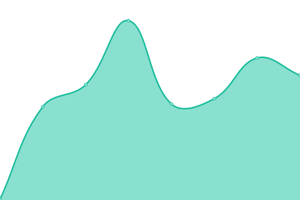
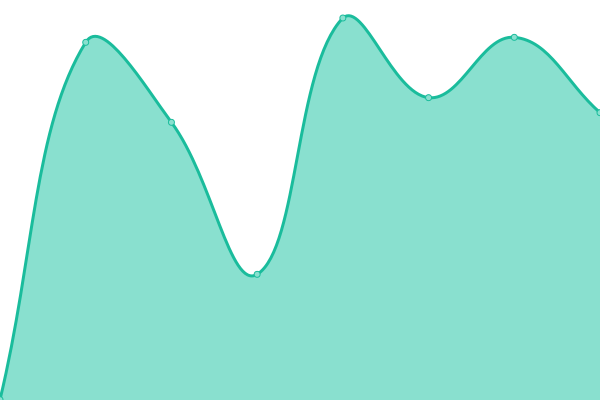
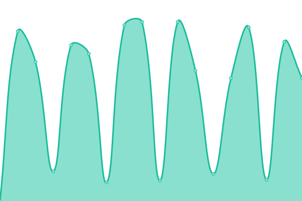
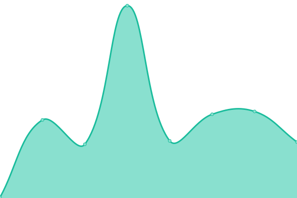

# [📈 Live Status](https://draken.wibu.life): <!--live status--> **🟧 Partial outage**

This repository contains the open-source uptime monitor and status page for [Upptime](https://upptime.js.org), powered by [Upptime](https://github.com/upptime/upptime).

With [Upptime](https://upptime.js.org), you can get your own unlimited and free uptime monitor and status page, powered entirely by a GitHub repository. We use [Issues](https://github.com/upptime/upptime/issues) as incident reports, [Actions](https://github.com/Talkc0n/upptime/actions) as uptime monitors, and [Pages](https://draken.wibu.life) for the status page.

<!--start: status pages-->
<!-- This summary is generated by Upptime (https://github.com/upptime/upptime) -->
<!-- Do not edit this manually, your changes will be overwritten -->
<!-- prettier-ignore -->
| URL | Status | History | Response Time | Uptime |
| --- | ------ | ------- | ------------- | ------ |
|  [Yuri Garden - Homepage](https://yurigarden.com) | 🟥 Down | [yuri-garden-homepage.yml](https://github.com/Talkc0n/upptime/commits/HEAD/history/yuri-garden-homepage.yml) | 

 183ms
     
 | 

<a href="https://draken.wibu.life/history/yuri-garden-homepage">0.00%</a>
    

|  [Yuri Garden - R18 Page](https://yurigarden.com/r18) | 🟥 Down | [yuri-garden-r18-page.yml](https://github.com/Talkc0n/upptime/commits/HEAD/history/yuri-garden-r18-page.yml) | 

 20ms
     
 | 

<a href="https://draken.wibu.life/history/yuri-garden-r18-page">0.00%</a>
    

|  [Yuri Garden - API Endpoint](https://api.yurigarden.com/index.html) | 🟥 Down | [yuri-garden-api-endpoint.yml](https://github.com/Talkc0n/upptime/commits/HEAD/history/yuri-garden-api-endpoint.yml) | 

 166ms
     
 | 

<a href="https://draken.wibu.life/history/yuri-garden-api-endpoint">0.00%</a>
    

|  [Yuri Garden - DB](https://db.yurigarden.com/storage/v1/object/public/yuri-garden-store/comics/33/thumbnail.jfif?v=1) | 🟥 Down | [yuri-garden-db.yml](https://github.com/Talkc0n/upptime/commits/HEAD/history/yuri-garden-db.yml) | 

 141ms
     
 | 

<a href="https://draken.wibu.life/history/yuri-garden-db">0.00%</a>
    

|  [Yuri Garden - Uploader](https://uploader.yurigarden.com/index.html) | 🟥 Down | [yuri-garden-uploader.yml](https://github.com/Talkc0n/upptime/commits/HEAD/history/yuri-garden-uploader.yml) | 

 138ms
     
 | 

<a href="https://draken.wibu.life/history/yuri-garden-uploader">0.00%</a>
    

|  [KuroNeko - Việt Hentai](https://vi-hentai.moe) | 🟩 Up | [kuro-neko-viet-hentai.yml](https://github.com/Talkc0n/upptime/commits/HEAD/history/kuro-neko-viet-hentai.yml) | 

 317ms
     
 | 

<a href="https://draken.wibu.life/history/kuro-neko-viet-hentai">100.00%</a>
    

|  [MimiHentai](https://mimihentai.com/blocked) | 🟩 Up | [mimi-hentai.yml](https://github.com/Talkc0n/upptime/commits/HEAD/history/mimi-hentai.yml) | 

 468ms
     
 | 

<a href="https://draken.wibu.life/history/mimi-hentai">99.29%</a>
    

|  [MimiHentai - API Endpoint](https://api.mimihentai.com) | 🟩 Up | [mimi-hentai-api-endpoint.yml](https://github.com/Talkc0n/upptime/commits/HEAD/history/mimi-hentai-api-endpoint.yml) | 

 157ms
     
 | 

<a href="https://draken.wibu.life/history/mimi-hentai-api-endpoint">100.00%</a>
    

|  [MimiHentai - CDN Server](https://cdn.mimihentai.com) | 🟩 Up | [mimi-hentai-cdn-server.yml](https://github.com/Talkc0n/upptime/commits/HEAD/history/mimi-hentai-cdn-server.yml) | 

 159ms
     
 | 

<a href="https://draken.wibu.life/history/mimi-hentai-cdn-server">100.00%</a>
    

<!--end: status pages-->

[**Visit our status website →**](https://draken.wibu.life)

## 📄 License

- Powered by: [Upptime](https://github.com/upptime/upptime)
- Code: [MIT](./LICENSE) © [Anand Chowdhary](https://anandchowdhary.com), supported by [Pabio](https://pabio.com)
- Data in the `./history` directory: [Open Database License](https://opendatacommons.org/licenses/odbl/1-0/)
